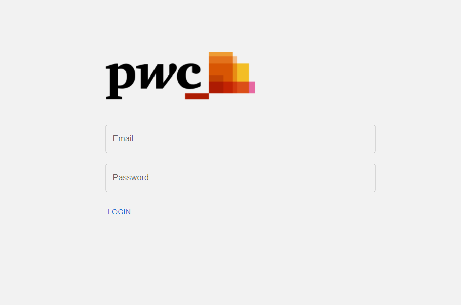
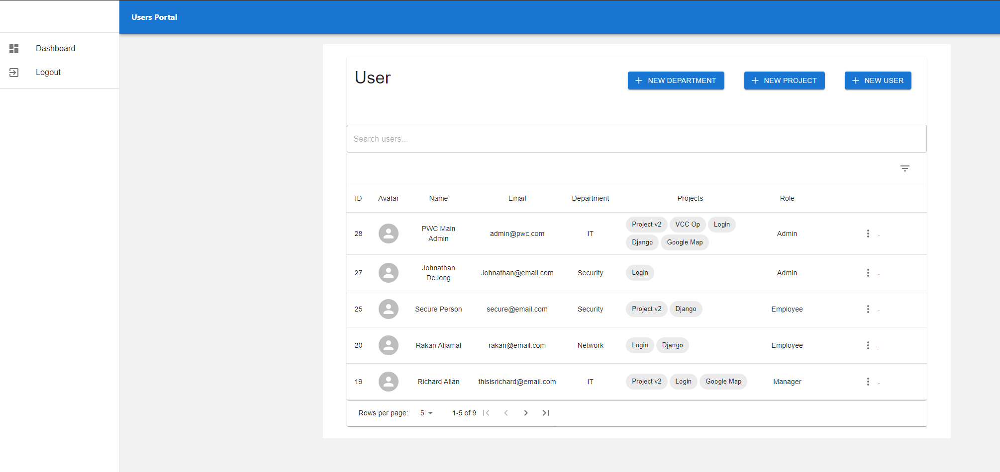
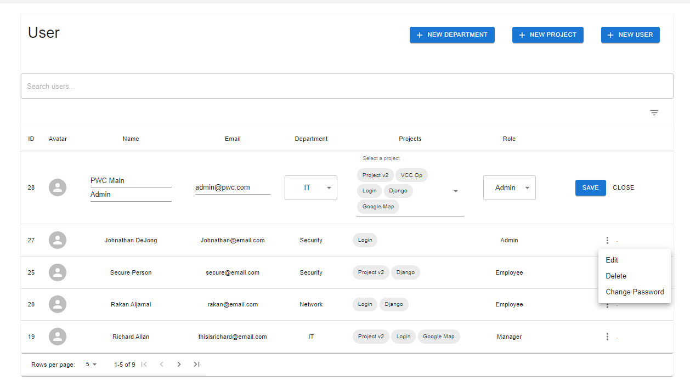
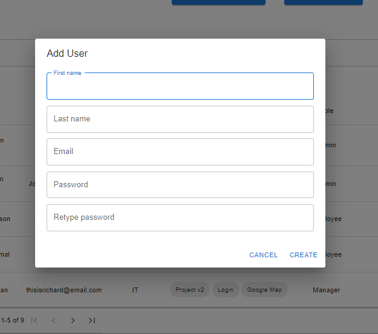
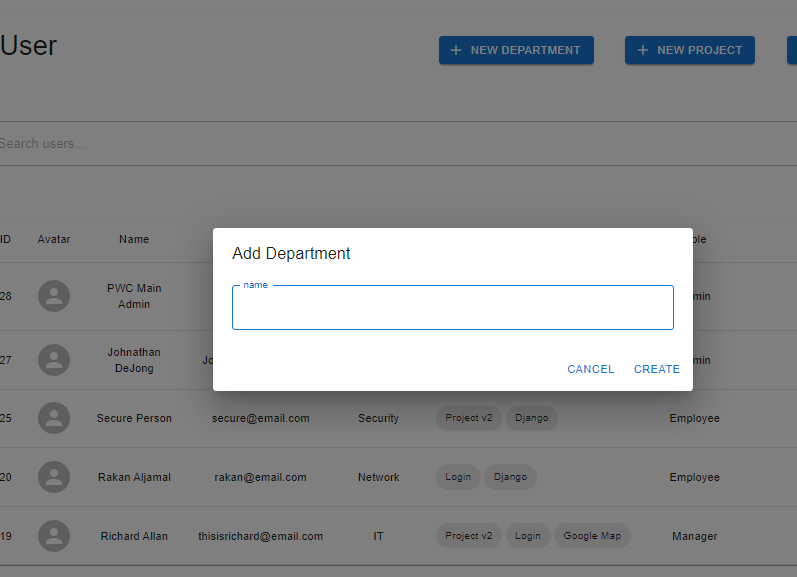
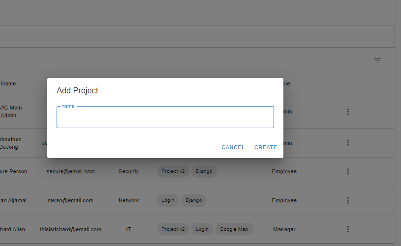

## Screenshots

---









---
This is a [Next.js](https://nextjs.org/) project bootstrapped with [`create-next-app`](https://github.com/vercel/next.js/tree/canary/packages/create-next-app).
For **technical assessment purposes**
## Getting Started

First, run the development server:

```bash
npm run dev
# or
yarn dev
```

<span style="color:orange;padding:5px;border-bottom:1px solid red;border-top:1px solid red">Make sure [portal api](https://github.com/RakanAljamal/Backend-management-portal) is running </span>

Open [http://localhost:8085](http://localhost:8085) with your browser to see the result.

## Learn More

To learn more about Next.js, take a look at the following resources:

- [Next.js Documentation](https://nextjs.org/docs) - learn about Next.js features and API.
- [Learn Next.js](https://nextjs.org/learn) - an interactive Next.js tutorial.

You can check out [the Next.js GitHub repository](https://github.com/vercel/next.js/) - your feedback and contributions are welcome!
